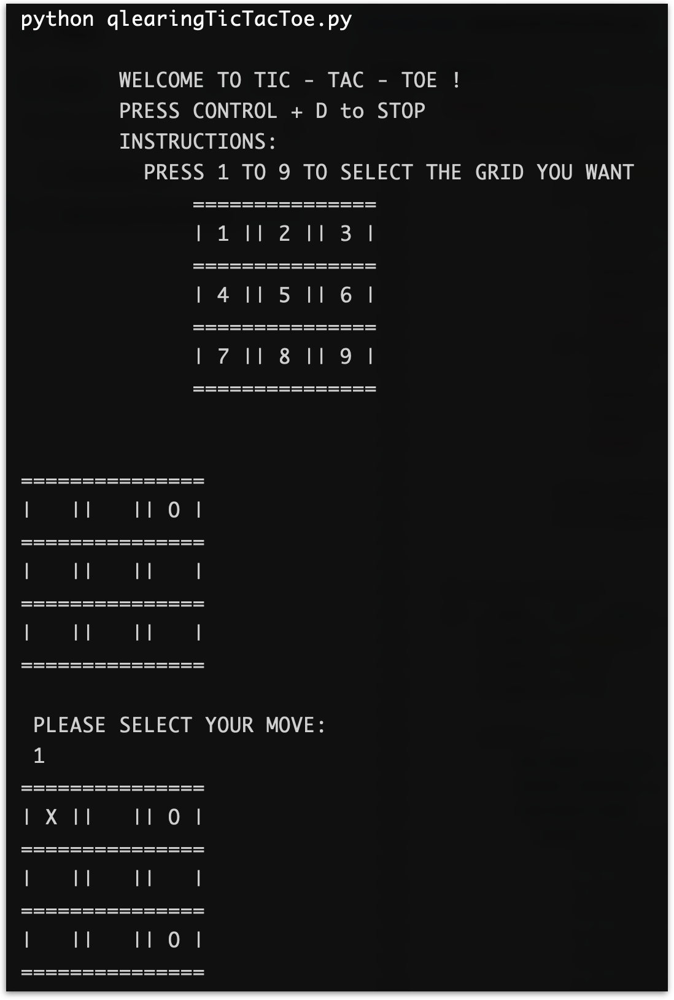

# tic-tac-toe
<h2 align='center'>
        A Q-learning program to play tic-tac-toe
</h2>

{:target='Apple', style='align:center'}
**Preview of the command line interface**

### 🎯 Objective
- A program that plays Tic-Tac-Toe using Q-Learning. 

### 🎬 Getting started
The following are the steps to setup this project:

####  To run tic-tac-toe

```zsh
git clone https://github.com/kaleoyster/tic-tac-toe.git
```

